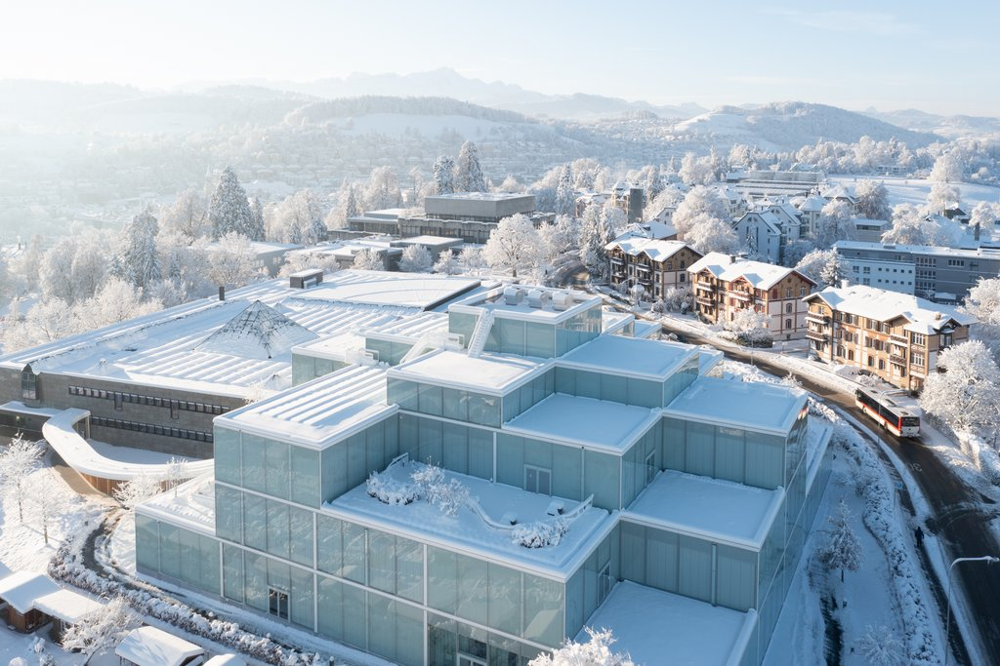

# Program Information (Tentative)

# Decentralization in Organizations (DiO) Conference 2024

**Date:** June 17-18, 2024  
**Location:** University of St. Gallen Executive Campus, Holzstrasse 15, 9010 St.Gallen  
**All times displayed in Central Europe Time**

## Program

### Monday, June 17

- **8:00-9:00 AM** - **Breakfast & Registration**
- **9:00-9:10 AM** - **Welcome and Introduction**
  - ***Organizers*** & President of University of St. Gallen, ***Manuel Ammann***
- **9:10-10:30 AM** - **The human side of decentralization**
  - **Paper Session**
    - Presenter: ***Bex Hewett***, *"Decentralization and high employee involvement: a configurational perspective"*
    - Presenter: **Mike Lee**, *"Is decentralization better for everyone? Investigating employee characteristics that drive preferences for working in decentralized structures"*
    - Discussant: **Markus Reizig**
- **10:30-10:50 AM** - **Coffee Break**
- **10:50-12:30 PM** - **Prospects for platform**
  - **Panel Session**
    - Panelists: **Melissa Schilling (lead), Tammy Madsen, Joost Rietveld, & Danny Sokol**
- **12:30-2:00 PM** - **Lunch**
- **2:00-3:20 PM** - **Tradeoffs in decentralization**
  - **Paper Session**
    - Presenter: **Vivianna Fang He**, *"Balancing convergence and deliberation in decentralized consensus formation"*
    - Presenter: **Linus Dahlander**, *"Network Intervention in the age of AI"*
    - Discussant: **Charlie Williams**
- **3:20-3:40 PM** - **Coffee Break**
- **3:40-5:30 PM** - **Opportunities for decentralization research**  
  - **Special Session**
    - Presenter: **Helge Klapper**, *"Decentralized organizational structure and misalignment in DAOs"*
    - Presenter: **John Eklund**, *"Building a unique database on decentralized organization design"*
    - Presenter: **Ying-Ying Hsieh**, *"Introducing the DREAM Project"*
    - Discussant: **Oliver Alexy**
- **5:30-6:30 PM** - **Decentralized Feedback: Community as your sounding board**  
  - MC: **Tobias Krestchmer**
- **6:30-7:00 PM** - **Break**
- **7:00 PM** - **Reception & Keynote by Kathy Eisenhardt**
  - Location: Central Terrace, Executive Campus

### Tuesday, June 18

- **8:30-9:00 AM** - **Breakfast & Registration**
- **9:00-10:20 AM** - **Blockchains: Meaning & Functionality**
  - **Paper Session**
    - Presenter: **Semi Min**, *"Computational Text Analysis in the Study of the Evolution of the Meaning of Novel Technologies"*
    - Presenter: **Brian Wu**, *"Blockchains: Fusing Extant Organizational Functionalities Under the CAP Tradeoff"*
    - Discussant: **Phanish Puranam**
- **10:20-10:40 AM** - **Coffee break**
- **10:40-12:10 PM** - **Decentralized Technologies**  
  - **Panel Session**
    - Panelists: **Sonali Shah (lead), Paolo Leone, & Alex Murray**
- **12:10-1:30 PM** - **Lunch**
- **1:30-2:50 PM** - **Democratizing organizations**
  - **Paper Session**
    - Presenter: **Trevor Young-Hyman**, *"Decentralized governance rights"*
    - Presenter: **Felipe Massa**, *"Fostering Dignity at Scale: Jaipur Rugs and the Reflexive Management of Artisanal Craftwork"*
    - Discussant: **Martin Kornberger**
- **2:50-3:10 PM** - **Coffee Break**
- **3:10-4:30 PM** - **Decentralized Governance**  
  - **Paper Session**
    - Presenter: **Katherine Chen**, *"Rapid growth as a threat to community governance? A case of Kodomo Shokudo in Japan"*
    - Presenter: **Gurneeta Vasude**, *"Governance of data resources and market valuation"*
    - Discussant: **Carliss Baldwin**
- **4:30-5:30 PM** - **Decentralization and grand challenges**
  - **Panel Session**
    - Panelists: **Paul Adler & Johanna Mair**
    - Moderator: **Vivianna Fang He**
- **5:30-6:00 PM** - **Reflection and outlook**  
  - **The organizers & all participants**
- **6:00- 7:00 PM** - **Break**
- **7:00-9:30 PM** - **Dinner**  
  - Location: [Restaurant Sauceria](https://www.sauceria.ch/)

[Download the program information in PDF](https://github.com/linxule/dio/asset/DiO_Conference_Program_2024.pdf)