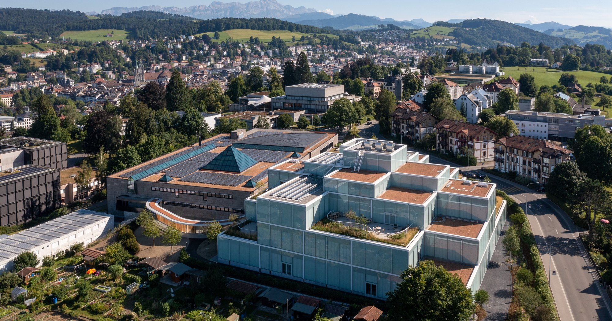

# Program Information

## Monday, June 17

- 8:00-9:00 AM: Breakfast & Registration
- 9:00-9:10 AM: Welcome and Introduction
- 9:10-10:30 AM: Tradeoffs in decentralization
  - Presenter: Brian Wu, Vivianna Fang He
- 10:30-10:50 AM: Coffee Break
- 10:50-12:10 PM: Experimenting with organizing
  - Presenter: Bex Hewett, Mike Lee
- 12:10-1:30 PM: Lunch
- 1:30-3:00 PM: Panel on Something cool about platforms
  - Panelists: Melissa Schilling, Tammy Madsen, Joost Rietveld, Danny Sokol
- 3:00-3:20 PM: Coffee Break
- 3:20-4:40 PM: (Title pending: Meaning and communities?)
  - Presenter: Semi, John Joseph
- 4:40-5:40 PM: Special session: Data & opportunities for decentralization research
  - Presenters: Ying-Ying Hsieh, John Eklund
- 5:40-6:00 PM: Break
- 6:00-7:00 PM: Community as your sounding board: Slideless 4-5 Pitches
- 7:00 PM: Reception & Keynote by Kathy Eisenhardt

## Tuesday, June 18

- 8:00-9:00 AM: Breakfast
- 9:00-10:20 AM: Democratizing organizations
  - Presenter: Felipe Massa, Trevor Young-Hyman
- 10:20-10:40 AM: Coffee break
- 10:40-12:10 PM: Panel on Decentralization and grand challenges
  - Panelists: Paul Adler, Katherine Chen, Johanna Mair
- 12:10-1:30 PM: Lunch
- 1:30-2:50 PM: Decentralized Innovation
  - Presenter: Ritta Katila, Gurneeta Vasude
- 2:50-3:10 PM: Coffee Break
- 3:10-4:30 PM: (Title pending)
  - Presenter: Linus Dahlander, Helge Klapper
- 4:30-6:00 PM: Panel on Decentralized Technologies
  - Panelists: Sonali Shah, Paolo Leone, Alex Murray
- 6:00-6:30 PM: Reflection and looking forward
- 6:30-7:00 PM: Break
- 7:00-9:30 PM: Dinner at Restaurant Sauceria (Getting to know Organization Design Community)