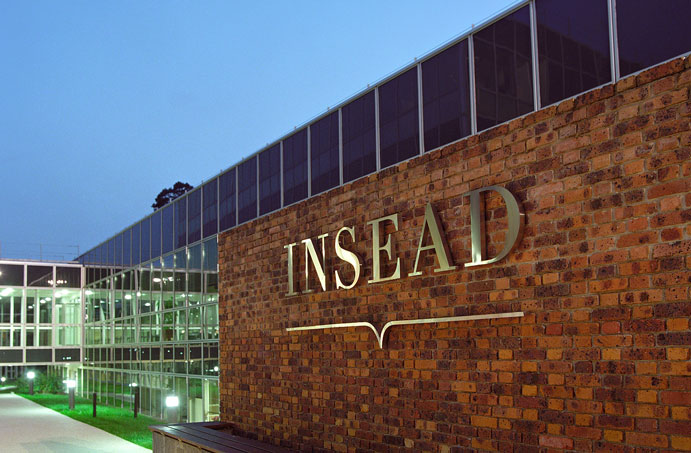

# DiO 2025: Decentralization in Organizations Conference

The DiO 2025 conference, set to occur at INSEAD in Fontainebleau, France, from June 17-18, is organized by Vivianna Fang He (UCL), Ying-Ying Hsieh (Imperial), Mike Lee (INSEAD), and Phanish Puranam (INSEAD).

Additionally, student representatives Julian Jonathan Markus (WU Vienna), Giorgia Sampò (SDU) and Magnus Van Haaren (RSM) contribute to the facilitation of this event.

Check out the following pages for more information:

- [Travel and Accomodation Information](https://dio-community.org/dio_2025/dio_2025_travel.html)
- [Conference Program](https://dio-community.org/dio_2025/dio_2025_program.html)

## Speakers (in alphabetical order)

| Name                    | Institution           |
| ----------------------  | --------------------- |
| Oliver Alexy            | TUM                   |
| Oliver Baumann          | SDU                   |
| Marya Besharov          | Oxford                |
| David Clough            | Uni. British Columbia |
| Kathy Eisenhardt        | Stanford              |
| John Eklund             | USC                   | 
| Robert Gregory          | Uni. of Miami         |       
| Bex Hewett              | Rotterdam             |
| Vivianna Fang He        | UCL                   |
| Ying-Ying Hsieh         | Imperial              |
| Helge Klapper           | Purdue                |
| Tobias Kretschemer      | LMU                   |
| Megan Larence           | Vanderbilt            |
| Mike Lee                | INSEAD                |
| Ronnie Lee              | Wharton               |
| Paolo Leone             | NOVA                  |
| Felipe Massa            | Vermont               |
| Phanish Puranam         | INSEAD                |
| Markus Reitzig          | Vienna                |
| Simone Santoni          | Bayes                 |
| Sonali Shah             | Uni. of Illinois      |
| Sherry Wu               | UCLA                  |
| Trevor Young-Hyman      | Pittsburgh            |
