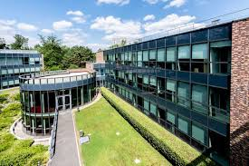

# Decentralization in Organizations (DiO) Conference 2024 – Program Information

For the most up-to-date information about the program, please refer to the document below. You can also [click here](https://docs.google.com/document/d/1RfIyiCdfJEgwp-vGf3Sde0Ubzt2vI5fL63gM2Y1aDag/edit?tab=t.0) to open the document in a new tab for downloading or printing.

_All times displayed are Central European Time (CET, UTC +1)._

# Tuesday, June 17

---

## 8:00-8:30 AM
{: .fw-300 }

## **Breakfast & Registration**
{: .mt-1}

---

## 8:30-8:45 AM
{: .fw-300 }

## **Welcome and Introduction**
{: .mt-1}

---

## 8:45-10:15 AM
{: .fw-300 .mb-1}

## **Framing the Frontier: Rethinking Decentralization in Organizations**
{: .mt-1}

(Session)

### **Presenter:** ***Kathy Eisenhardt***

*'Decentralization in Organizations: A Revolution or a Mirage?'*

### **Presenter:** ***Michael Lee, Trevor Young-Hyman, John Eklund***

*'The Building Blocks of Decentralization: Towards an Integrative Framework for Comparative Organization Design Research'*

### **Moderator:** ***Markus Reitzig***

---

## 10:15-10:35 AM
{: .fw-300 }

## **Coffee Break**
{: .mt-1}

---

## 10:35-12:05 PM
{: .fw-300 }

## **Leading Without Control? Examining Leadership in Decentralized Systems**
{: .mt-1}

(Paper Session)

### **Presenter:** ***Marya Besharov***

*'The Paradox of Participatory Leadership: How Containing Anxieties Enriches the Organization but Depletes the Leader'*

### **Presenter:** ***Helge Klapper***

*'What is the Role of Managers in Organizations that Promote Autonomy? A Model of Team Formation'*

### **Discussant:** ***Bex Hewett***

---

## 12:30-2:00 PM
{: .fw-300 .mb-1}

## **Lunch**
{: .mt-1}

---

## 2:00-3:30 PM
{: .fw-300 .mb-1}

## **Decision Making in DAOs**
{: .mt-1}

(Paper Session)

### **Presenter:** ***Robert Gregory***
{: .mb-1}

*'Beyond Market Value: Exploring the Interplay of Market and Civic Worth in Blockchain Token Design and Use'*

### **Presenter:** ***Oliver Baumann***
{: .mb-1}

*'‘Interdisciplinary Pathways in Research on DAOs (with Giorgia Sampò)'*

### **Discussant:** ***Tobias Kretschemer***

---

## 3:30-3:50 PM
{: .fw-300 .mb-1}

## **Coffee Break**
{: .mt-1}

---

## 3:50-4:15 PM
{: .fw-300 .mb-1}

## **Update on DREAM project**
{: .mt-1}

### **Presenter:** ***Ying-Ying Hsieh***

---

## 4:15-5:45 PM
{: .fw-300 .mb-1}

## **Counter-Normative Organizing: Paths to Institutional Change**
{: .mt-1}

(Paper Session)

### **Presenter:** ***Trevor Young-Hyman***

*'From Utopianism to Pragmatism:  How Ontological Shifts Enable the Emergence of Organizational Democracy'*

### **Presenter:** ***Paolo Leone***

*'How Scientists Cope with Research Pathologies: The Development of Post-Publication Peer Review'*

### **Discussant:** ***Simone Santoni***

---

## 5:45-6:30 PM
{: .fw-300 .mb-1}

## **Break**
{: .mt-1}

---

## 6:30 PM
{: .fw-300 .mb-1}

## **Dinner:** [La Papote, Bourron-Marlotte (by bus)](https://la-papote.com/)
{: .mt-1}

---

# Wednesday, June 18

---

## 8:30-9:00 AM
{: .fw-300 .mb-1}

## **Breakfast**
{: .mt-1}

---

## 9:00-10:30 AM
{: .fw-300 .mb-1}

## **Coordinating Autonomy: Participatory Structures in Innovation Work**
{: .mt-1}

(Paper Session)

### **Presenter:** ***Oliver Alexy***

*'Managing Complex Innovations within Decentralized Forms of Organizing through Structural Mirroring’'*

### **Presenter:** ***Vivianna Fang He***

*'Co-creation of Onnovation Controls'*

### **Discussant:** ***Sonali Shah***

---

## 10:30-10:50 AM
{: .fw-300 .mb-1}

## **Coffee Break**
{: .mt-1}

---

## 10:50-12:20 PM
{: .fw-300 .mb-1}

## **Participation in Decentralized Organizations: Its Maintenance and Consequences**
{: .mt-1}

(Paper Session)

### **Presenter:** ***Sherry Wu***

*'The Global Impact of Local Group Participation: Field Experiments on Work and Civic Groups'*

### **Presenter:** ***Felipe Massa***

*'When the Time Comes: Pursuing Social Change through a Points-based Participation Architecture'*

### **Discussant:** ***Phanish Puranam***

---

## 12:20-1:30 PM
{: .fw-300 .mb-1}

## **Lunch**
{: .mt-1}

---

## 1:30-3:00 PM
{: .fw-300 .mb-1}

## **Structural Evolution in Nascent Firms**
{: .mt-1}

(Paper Session)

### **Presenter:** ***Ronnie Lee***

*'Structural Evolution of New Ventures: Large-scale Evidence from U.S. Employer-employee-matched Data'*

### **Presenter:** ***Megan Larence***

*'‘Hierarchy Expansion in Young Firms: The Impact of Internal versus External Hiring on Performance'*

### **Discussant:** ***David Clough***

---

## 3:00-04:30 PM
{: .fw-300 .mb-1}

## **Forest Walk in Small Groups**
{: .mt-1}

---

## 4:30-6:00 PM
{: .fw-300 .mb-1}

## **Looking Forward: Shaping the Future of Decentralization Research**
{: .mt-1}

### **Moderators:** ***Phanish Puranam, Michael Lee, Vivianna He, Ying-Ying Hsieh***

---

## 6:00-7:00 PM
{: .fw-300 .mb-1}

## **Break**
{: .mt-1}

---

## 7:00-10:00 PM
{: .fw-300 .mb-1}

## **Dinner and drinks:** [Gina Restaurant, Fointainebleau](https://hoteldecavoye.com/fr/page/bar-hotel-restaurant-fontainebleau.19218.html)
{: .mt-1}

---

# Contact Information

## Organizers

- [Vivianna Fang He](https://www.viviannafanghe.com/)
  - Email: [vivianna.he@ucl.ac.uk](vivianna.he@ucl.ac.uk)
- [Ying-Ying Hsieh](https://www.imperial.ac.uk/people/y.hsieh)
  - Email: [y.hsieh@imperial.ac.uk](mailto:y.hsieh@imperial.ac.uk)
- [Mike Lee](https://www.michaelylee.co/bio)
  - Email: [mike.lee@insead.edu](mailto:mike.lee@insead.edu)
- [Phanish Puranam](https://www.insead.edu/faculty/phanish-puranam)
  - Email: [phanish.puranam@insead.edu](mailto:phanish.puranam@insead.edu)

## Online Moderation Team

- [Julian Jonathan Markus](https://research.wu.ac.at/en/persons/jj-julian-jonathan-markus)
  - Email: [julian.jonathan.markus@wu.ac.at](mailto:julian.jonathan.markus@wu.ac.at)
- [Giorgia Sampò](https://www.sdu.dk/en/forskning/forskningsenheder/samf/sod/simple-employee-list-sod/group-members/giorgia-sampo)
  - Email: [gisa@sam.sdu.dk](mailto:gisa@sam.sdu.dk)
- [Magnus van Haaren](https://www.erim.eur.nl/people/magnus-van-haaren/)
  - Email: [vanhaaren@rsm.nl](mailto:vanhaaren@rsm.nl)
