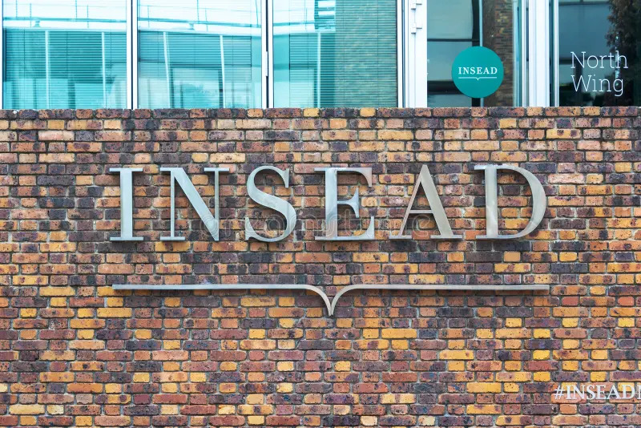

# DiO 2026: Decentralization in Organizations Conference

The DiO 2026 conference, set to occur at INSEAD in Fontainebleau, France, from June 16-17, is organized by Vivianna Fang He (UCL), Ying-Ying Hsieh (Imperial), Michael Lee (INSEAD), and Phanish Puranam (INSEAD).

Additionally, student representatives Julian Jonathan Markus (WU Vienna) and Giorgia Sampò (SDU) contribute to the facilitation of this event.

Check out the following pages for more information:

- [Travel and Accomodation Information](https://dio-community.org/dio_2026/dio_2026_travel.html)
- [Conference Program](https://dio-community.org/dio_2026/dio_2026_program.html)

## Speakers (in alphabetical order)

| Name                    | Institution           |
| ----------------------  | --------------------- |
| Oliver Baumann          | SDU                   |
| Carliss Baldwin         | Harvard               |
| Theo Beutel             | Ethereum              |
| Matteo Devigli          | INSEAD                |
| John Eklund             | USC Marshall          |
| Vivianna Fang He        | UCL                   |
| Marylene Gagne          | Curtin                |
| Piyush Gulati           | UCL                   |
| Bex Hewett              | Rotterdam             |
| Ying-Ying Hsieh         | Imperial              |
| Arvind Karunakaran      | Stanford              |
| Harsh Ketkar            | McCombs               |
| Tobias Kretschmer       | Imperial              |
| Michael Lee             | INSEAD                |
| Sunny Lee               | UCL                   |
| Dan Levinthal           | Wharton               |
| Chengwei Liu            | Imperial              |
| Arianna Marchetti       | LBS                   |
| Frank Martela           | Aalto                 |
| Felipe Massa            | Vermont               |
| Phanish Puranam         | INSEAD                |
| Markus Reitzig          | Vienna                |
| JP Vergne               | UCL                   |
| Shun Yiu                | Kelley                |