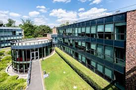

# Decentralization in Organizations (DiO) Conference 2026 – Program Information

For the most up-to-date information about the program, please refer to the document below. You can also [click here](https://docs.google.com/document/d/1git7oJHcIR3Fme-hVGXVwYbAIp_508uSYga8P9Xnr8E/edit?tab=t.0) to open the document in a new tab for downloading or printing.

_All times displayed are Central European Time (CET, UTC +1)._

# Tuesday, June 16

---

## 8:00-8:30 AM
{: .fw-300 }

## **Breakfast & Registration**
{: .mt-1}

---

## 8:30-9:00 AM
{: .fw-300 }

## **Welcome and Introduction**
{: .mt-1}

### ***Lily Fang, Dean of Research and Innovation, INSEAD***

### ***Michael Lee and Phanish Puranam (hosts of DiO2026)***

---

## 9:00-10:15 AM
{: .fw-300 .mb-1}

## **Framing the Frontier: Rethinking Decentralization**
{: .mt-1}

### **Presenter:** ***Dan Levinthal, Wharton***

*'Decentralized adaptation in markets and organizations'*

### **Presenter:** ***Carliss Baldwin, Harvard***

*'Technological paradigms and decentralization'*

### **Moderator:** ***Phanish Puranam, Insead***

---

## 10:15-10:35 AM
{: .fw-300 }

## **Coffee Break**
{: .mt-1}

---

## 10:35-12:05 PM
{: .fw-300 }

## **Control & Governance in Digital Organizations**
{: .mt-1}

(Paper Session)

### **Presenter:** ***Oliver Baumann, SDU***

*'Platform Bypass: Informal Collaboration and Ecosystem Adaptation in Crisis Times'*

### **Presenter:** ***JP Vergne, UCL***

*'Authority Dispersion on Blockchain Platforms'*

### **Discussant:** ***John Eklund, USC Marshall***

---

## 12:30-2:00 PM
{: .fw-300 .mb-1}

## **Lunch at INSEAD canteen**
{: .mt-1}

---

## 2:00-3:30 PM
{: .fw-300 .mb-1}

## **Participation and Conflict in Decentralized Organizations**
{: .mt-1}

(Paper Session)

### **Presenter:** ***Bex Hewett, Rotterdam***
{: .mb-1}

*'Variations in Participation in Self-Managing Organizations'*

### **Presenter:** ***Arvind Karunakaran, Stanford***
{: .mb-1}

*'Conflicts among symmetric occupational groups at Tech Co'*

### **Discussant:** ***Felipe Massa, Vermont***

---

## 3:30-3:50 PM
{: .fw-300 .mb-1}

## **Coffee Break**
{: .mt-1}

---

## 3:50-4:15 PM
{: .fw-300 .mb-1}

## **DREAM about DAOs**
{: .mt-1}

### **Presenter:** ***Ying-Ying Hsieh, Imperial & Theo Beutel, Ethereum***

---

## 4:15-5:45 PM
{: .fw-300 .mb-1}

## **Decentralization & organizational Learning**
{: .mt-1}

(Paper Session)

### **Presenter:** ***Chengwei Liu, Imperial***

*'From population diversity to target diversity'*

### **Presenter:** ***Harsh Ketkar, McCombs***

*'Riding the jagged frontier: Coordination and robustness in human-AI organizations'*

### **Discussant:** ***Oliver Baumann, SDU***

---

## 5:45-6:30 PM
{: .fw-300 .mb-1}

## **Break**
{: .mt-1}

---

## 6:30 PM
{: .fw-300 .mb-1}

## **Dinner:** [La Papote, Bourron-Marlotte (by bus)](https://la-papote.com/)
{: .mt-1}

---

# Wednesday, June 17

---

## 8:30-9:00 AM
{: .fw-300 .mb-1}

## **Breakfast**
{: .mt-1}

---

## 9:00-10:30 AM
{: .fw-300 .mb-1}

## **Decentralization and Human Capital**
{: .mt-1}

(Paper Session)

### **Presenter:** ***Michael Lee, INSEAD***

*'How much Decentralization is too much? Worker preferences across degrees of Decentralization'*

### **Presenter:** ***Piyush Gulati, UCL***

*'Mitigating disruption: Hiring for social skills and post-acquisition performance'*

### **Discussant:** ***Arianna Marchetti, SMU***

---

## 10:30-10:50 AM
{: .fw-300 .mb-1}

## **Coffee Break**
{: .mt-1}

---

## 10:50-12:20 PM
{: .fw-300 .mb-1}

## **Decentralization in Digital Organizational Forms**
{: .mt-1}

(Paper Session)

### **Presenter:** ***Shun Yiu, Kelley***

*'Appropriability in platform governance: How decentralization of decision rights erodes participation'*

### **Presenter:** ***Matteo Devigli, Insead***

*'Penguins Don't Talk, But They Huddle: How Organizational Plans Redistribute Feedback'*

### **Discussant:** ***Vivianna Fang He, UCL***

---

## 12:20-1:30 PM
{: .fw-300 .mb-1}

## **Lunch at INSEAD canteen**
{: .mt-1}

---

## 1:30-3:00 PM
{: .fw-300 .mb-1}

## **Rapid Fire Sessions**
{: .mt-1}

Short pitches on new ideas/papers

### **Presenter:** ***Sunny Lee, UCL***
### **Presenter:** ***Arianna Marchetti, LBS***
### **Presenter:** ***Marylene Gagne, Curtin***
### **Presenter:** ***Frank Martela, Aalto***
### **Facilitator**: ***Michael Lee, Insead***

---

## 3:00-5:00 PM
{: .fw-300 .mb-1}

## **Living Case Exploration: Scaling Decentralized Organizing**
{: .mt-1}

### **Moderators:** ***Phanish Puranam, Michael Lee, Vivianna He, Ying-Ying Hsieh***

---

## 5:00-6:00 PM
{: .fw-300 .mb-1}

## **Closing**
{: .mt-1}

---

## 6:00-7:00 PM
{: .fw-300 .mb-1}

## **Break**
{: .mt-1}

---

## 7:00-10:00 PM
{: .fw-300 .mb-1}

## **Dinner and drinks:** [Gina Restaurant, Fointainebleau](https://hoteldecavoye.com/fr/page/bar-hotel-restaurant-fontainebleau.19218.html)
{: .mt-1}

---

# Contact Information

## Organizers

- [Vivianna Fang He](https://www.viviannafanghe.com/)
  - Email: [vivianna.he@ucl.ac.uk](vivianna.he@ucl.ac.uk)
- [Ying-Ying Hsieh](https://www.imperial.ac.uk/people/y.hsieh)
  - Email: [y.hsieh@imperial.ac.uk](mailto:y.hsieh@imperial.ac.uk)
- [Michael Lee](https://www.michaelylee.co/bio)
  - Email: [mike.lee@insead.edu](mailto:mike.lee@insead.edu)
- [Phanish Puranam](https://www.insead.edu/faculty/phanish-puranam)
  - Email: [phanish.puranam@insead.edu](mailto:phanish.puranam@insead.edu)

## Online Moderation Team

- [Julian Jonathan Markus](https://research.wu.ac.at/en/persons/jj-julian-jonathan-markus)
  - Email: [julian.jonathan.markus@wu.ac.at](mailto:julian.jonathan.markus@wu.ac.at)
- [Giorgia Sampò](https://www.sdu.dk/en/forskning/forskningsenheder/samf/sod/simple-employee-list-sod/group-members/giorgia-sampo)
  - Email: [gisa@sam.sdu.dk](mailto:gisa@sam.sdu.dk)
